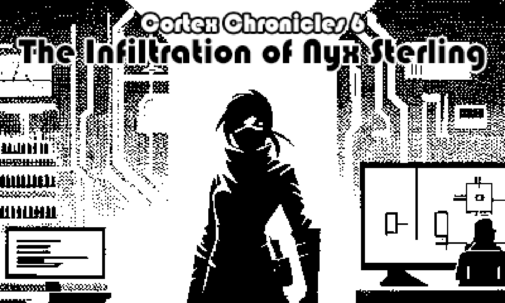
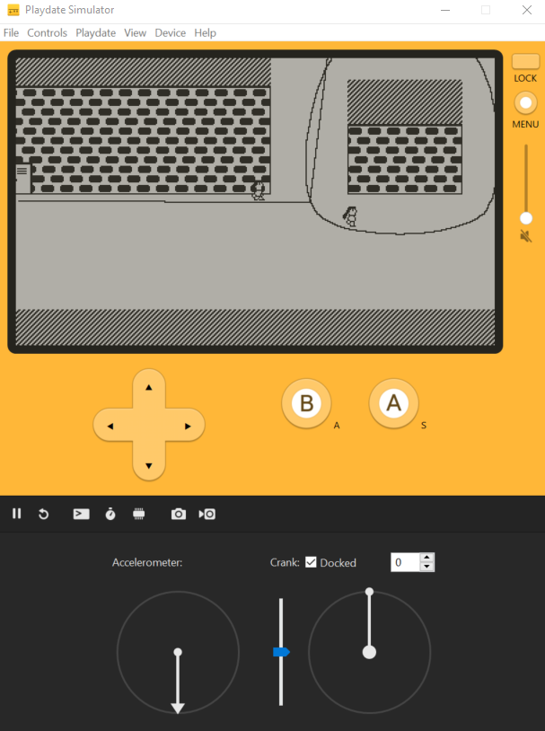
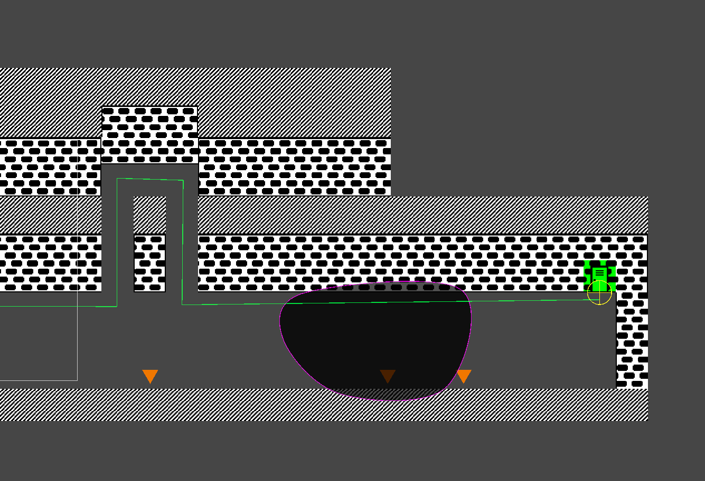
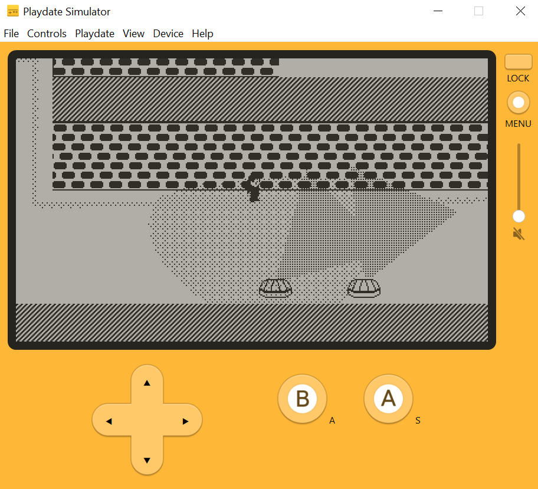
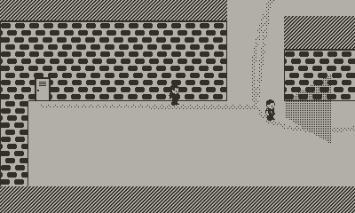
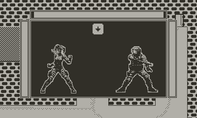
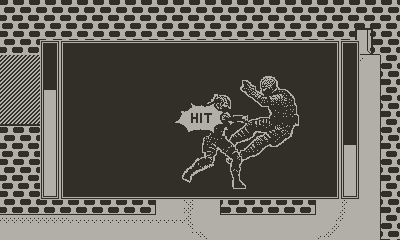
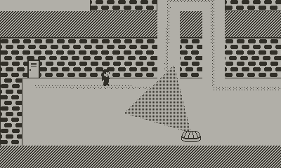

# THE CORTEX CHRONICLES, CHAPTER 6 - THE INFILTRATION OF NYX STERLING

Developed for the Game Creator's Club at Lusofona University.
This month, the theme is [Playdate]

This is a part of what I hope will be "The Cortex Chronicles" - I want all the games I do for the Game Creator's Club this year to be linked together, hence this idea.
I also want to use a different engine on every entry, so let's see how that goes! :)

This time, I'm using the Playdate SDK, which is Lua-based and is one of two ways to build application for the Playdate. Since I don't have a device, I'm doing everything with the simulator.

Since the SDK doesn't have any editor tools, I used Unity to make a sort of level editor. From that level editor (done using some scripts and [OkapiKit] stuff), I can export some files with a custom format (building a tile palette, exporting tilemap and paths, along with enemies) that I can load with Lua code on the other end...

This game was a lot more work than I was expecting, but it ended up being quite a cool developmenmt experience.

## Game

In this game, the player is Nyx Sterling, a cat-burgler turned freedom fighter. She has to infiltrate the facility where Doctor Ignatius Cogwell is developing MoodMorph, a mind altering drug. We have to prevent him from completing his research and deploy it, further increasing the control Prime Nexus' control over society.

The player can only control Nyx using the crank, to walk forward or back, avoiding being seen by the guards, security cameras, etc.

If Nyx is caught by guards, she'll have to fight the guard using some quick-time events. Player can also sneak behind the guards and press the B key to strangle them using the crank. Strangling guards spends less stamina than the other options of direct confrontation.
Security turrets shoot at the Nyx if she's seen, which will kill her immediately. Nyx can avoid being spotted by staying the dark spaces of the map.

## Other screenshots 

## Art

- Everything done by Diogo de Andrade, licensed through the [CC0] license.
- Static images generated with Dall-E and processed
- Sprites created using [LPC character generator] and then adapted for 32x32 and black & white.
- Music by [klavo1985], licensed through the [CC-BY-SA 4.0] license

## Licenses

- All game source code by Diogo de Andrade is licensed under the [MIT] license.

## Metadata

- Autor: [Diogo Andrade]

[Diogo Andrade]:https://github.com/DiogoDeAndrade
[CC0]:https://creativecommons.org/publicdomain/zero/1.0/
[CC-BY-SA 4.0]:http://creativecommons.org/licenses/by-sa/4.0/
[MIT]:LICENSE
[OkapiKit]:https://github.com/VideojogosLusofona/OkapiKit
[Playdate]:https://https://play.date/
[LPC character generator]:https://sanderfrenken.github.io/Universal-LPC-Spritesheet-Character-Generator
[klavo1985]:https://opengameart.org/users/klavo1985